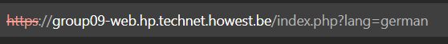
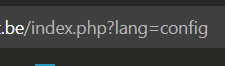
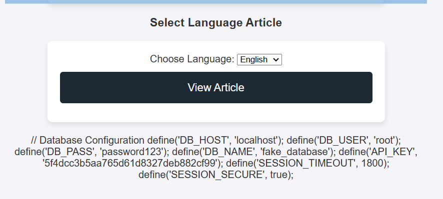

# Solution for the LFI challenge

The challenge is present in the article section where you can choose the language. You type other files in the url, ex. config then it will show the **fake** config.php  
## Final solution
In the url change `lang=english` to `lang=config`

## Step by step
If you select a language you can see that it is given as the query parameter in the url and is displayed under the input field

So you can assume it uses `german.php` file and try to type some other important files such as `config.php`.  
So change the lang query param to config

Now you can see config.php with database configuration

